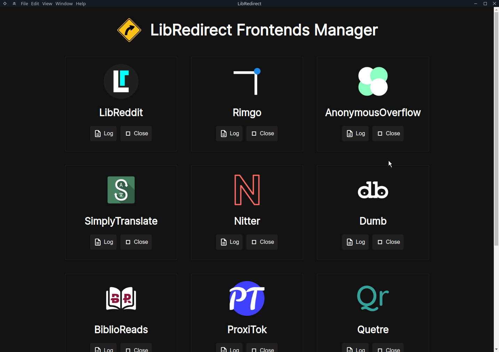

# LibRedirect Frontends Manager



Host frontends locally on your computer rather than relying on 3rd party instances, and anonymize your IP through Loki (still not implemented). A much better trust-less model.

Installed Frontends:
- [BreezeWiki](https://breezewiki.com/) (inux)
- [LibReddit](https://github.com/spikecodes/libreddit) (linux, windows)
- [Nitter](https://github.com/zedeus/nitter) (linux)
- [Rimgo](https://codeberg.org/video-prize-ranch/rimgo) (linux, windows)
- [SimplyTranslate](https://git.sr.ht/~metalune/simplytranslate_web) (linux)
- [AnonymousOverflow](https://github.com/httpjamesm/AnonymousOverflow) (linux, windows)
- [Dumb](https://github.com/rramiachraf/dumb) (linux, windows)
- [BiblioReads](https://github.com/nesaku/BiblioReads) (linux, windows)
- [ProxiTok](https://github.com/pablouser1/ProxiTok) (linux, windows)
- [Quetre](https://github.com/zyachel/quetre) (linux, windows)
- [LibreMDb](https://github.com/zyachel/libremdb) (linux, windows)
- [SearXNG](https://github.com/searxng/searxng) (linux, windows)

For Managing the frontends:
- Web Server: [Caddy](https://caddyserver.com/)
- Cache Server: [Redis](https://redis.io/)
- GUI: [Node.js](https://nodejs.org/) + [Electron](https://www.electronjs.org/)
- Complex frontends: [Docker](https://www.docker.com/)

## Development Linux
Install [Docker Compose](https://docs.docker.com/desktop/install/linux-install/)
```bash
sudo snap install node --channel=14/stable --classic # Newer versions aren't working
git clone --depth 1 https://github.com/libredirect/frontends_manager
cd frontends_manager/
npm install
npm run start
```

## Development Windows
Install [Docker Compose](https://docs.docker.com/desktop/install/windows-install/)\
Install [Node.js v18](https://nodejs.org/en/download)
```bash
git clone --depth 1 https://github.com/libredirect/frontends_manager
cd frontends_manager
npm install
npm run start
```