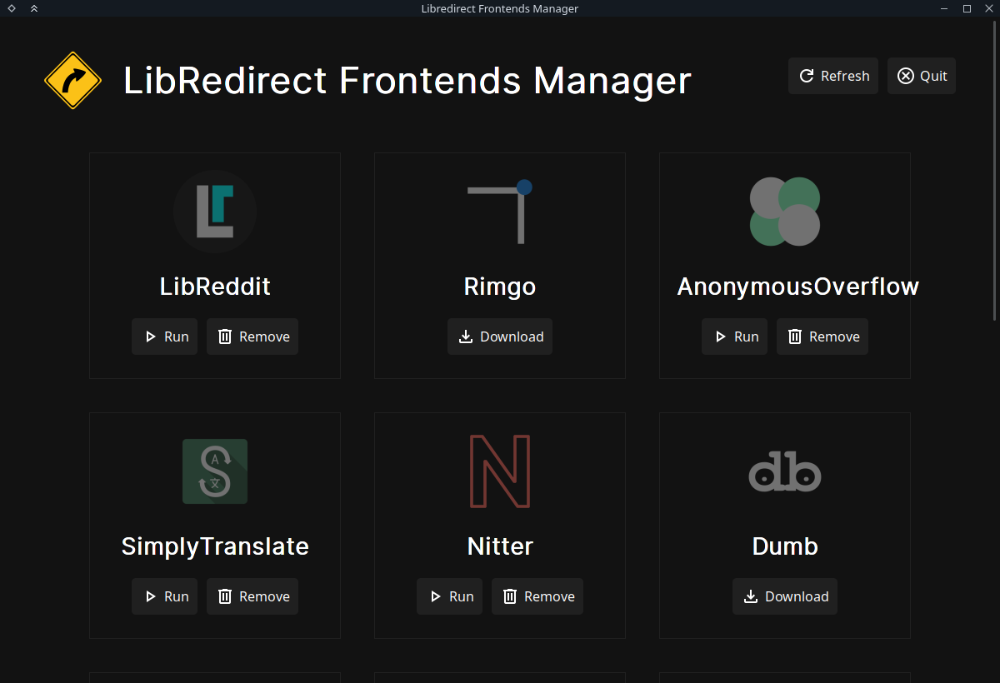

# LibRedirect Frontends Manager



Host frontends locally on your computer rather than relying on 3rd party instances. A much better trust-less model.\
For anonymizing your IP, use [Lokinet](https://lokinet.org/)

Available Frontends:
- [LibReddit](https://github.com/spikecodes/libreddit) (linux, windows)
- [Nitter](https://github.com/zedeus/nitter) (linux, windows)
- [Rimgo](https://codeberg.org/video-prize-ranch/rimgo) (linux, windows)
- [SimplyTranslate](https://git.sr.ht/~metalune/simplytranslate_web) (linux)
- [LingvaTranslate](https://github.com/TheDavidDelta/lingva-translate) (docker)
- [AnonymousOverflow](https://github.com/httpjamesm/AnonymousOverflow) (linux, windows)
- [Dumb](https://github.com/rramiachraf/dumb) (linux, windows)
- [BiblioReads](https://github.com/nesaku/BiblioReads) (docker)
- [ProxiTok](https://github.com/pablouser1/ProxiTok) (docker)
- [Quetre](https://github.com/zyachel/quetre) (docker)
- [LibreMDb](https://github.com/zyachel/libremdb) (docker)
- [SearXNG](https://github.com/searxng/searxng) (docker)
- [Teddit](https://github.com/teddit-net/teddit) (docker)

For Managing the frontends:
- Web Server: [Caddy](https://caddyserver.com/)
- Cache Server for some frontends: [Redis](https://redis.io/)
- Complex frontends: [Docker](https://www.docker.com/)
- GUI: [Tauri](https://tauri.app/)

## Development
Install [Rust](https://www.rust-lang.org/)\
Install [Docker](https://www.docker.com/)\
Install [Tauri](https://tauri.app/)
```bash
git clone https://github.com/libredirect/frontends_manager
cd frontends_manager
npm install
npm run tauri dev
```
